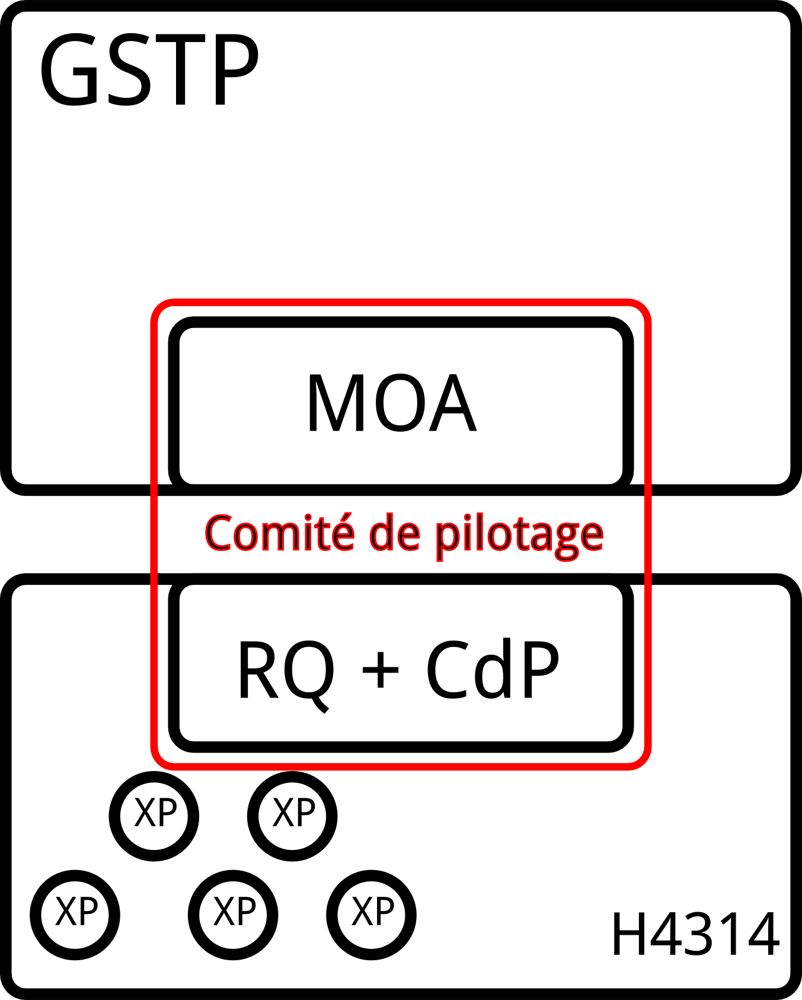

======================================
Plan d'assurance qualité projet (PAQP)
======================================

.. contents:: Sommaire
.. sectnum::

Terminologie
#############

CdP
  Chef de Projet
RQ
  Responsable Qualité

GSTP
  Entreprise de travaux de la présente étude de cas

PAQP
  Plan d'assurance Qualité Projet

MoA
  Maîtrise d'Ouvrage

MoE
  Maîtrise d'Oeuvre

SI
  Système d'information

Préliminaires
#################

Cadre du PAQP
===============

Le PAQP est mis en place dans le cadre de la réponse par l'hexanôme H4314 (MOE) à l'appel d'offre d'étude préalable de "Conception de système d'information" lancé par GSTP (MOA), entreprise de travaux, pour le domaine de gestion du matériel.

Objectifs du PAQP
====================

Le PAQP est rédigé pour remplir deux objectifs:

- définir l'itinéraire du projet: mise en place d'un contexte et d'un système de qualité tout au long de la conduite du projet. Ce PAQP doit être mis en oeuvre par la MOE afin de satisfaire la MOA.

- assurer la cohérence et l'homogénéité des documents et livrables produits par la MOE. Ainsi, le PAQP est mis en place pour assurer la qualité du produit obtenu.

Le PAQP définit:

  - la feuille de route du projet de réalisation du système, en précisant:
    - les responsabilités
    - les processus de développement (de la spécification à la validation)
    - de fournitures associées à la réalisation
    - les objectifs de la qualité

  - les relations entre:
    - les différentes équipes de la réalisation
    - le client (GSTP, MOA)
    - le Service Qualité du ou des organismes participant à la réalisation
    - la hierarchie

Domaines d'application
========================

Toute la documentation fournie par la MOE durant le projet est concernée par ce PAQP. Ainsi, toute décomposition en sous-projet de ce projet est concernée par ce PAQP.

Responsablités associées au PAQP
===================================

Tous les membres du projet sont concernés par le PAQP. Pour la bonne conduite du projet, il est obligatoire que le PAQP soit pris en connaissance par tous, et qu'il soit appliqué. 
Cependant, chaque personne a un rôle différent vis-à-vis du PAQP, qui sera précisé par la suite de ce document.

====================  =============================================
Acteur                Responsabilités
====================  =============================================
CdP                   Valider le PAQP, l'appliquer et le faire respecter
  
RQ                    Rédiger et améliorer le PAQP, garantir son application

Experts, Consultants  Appliquer le PAQP, et apporter les corrections nécessaires pour être en conformité avec le PAQP
====================  =============================================

Procédure d'évolution du PAQP
================================

Tout personne peut-être force de proposition pour faire évoluer le PAQP.
Le PAQP est un document qui par nature est régulièrement amélioré. L'objectif de ce document est d'assurer la bonne qualité du projet, et d'approcher le "Zero Defaut".

Le PAQP peut-être amené à évoluer pour plusieurs raisons:
- détection d'un défaut, d'une imprécision ou d'une faille dans le PAQP
- découverte d'une "Best-Practice" qui peut être source d'inspiration et de modèle pour le présent PAQP
- réflexion et mise en place d'une nouvelle idée.

Toute procédure d'évolution du PAQP doit être soumise au RQ, qui la prendra en considération, et qui devra être validée par le CdP.

Lorsqu'une procédure d'évolution du PAQP aboutie, tous les membres du projet sont avertis et informés.

Procédure à suivre en cas de non-application du PAQP
======================================================

Procédure en cas de non-application
--------------------------------------

Lorsqu'un document, résultat ou livrable produit par l'équipe du projet ne respecte pas le PAQP, il ne pourra pas être validé. Ceci est une règle essentielle.

L'auteur de la non-conformité ou de l'écart par rapport à la référence sera averti par le RQ et/ou le CdP, et il lui sera fourni les éléments et informations nécessaires à la correction.
Ce dernier devra alors prendre en compte ces informations, et procéder aux modifications nécessaires, pour que le document, résultat ou livrable produit puisse être définitivement validé. 

Procédure de dérogation
--------------------------

Un PAQP a pour objectif de mettre en place des règles de rigueur, et non pas du rigorisme.

Ainsi, il peut y avoir de la flexibilité dans l'application du PAQP.

De ce fait, si un membre de l'équipe du projet, pour un document, résultat ou livrable en cours de production, juge opportun pour des raisons données de ne pas appliquer des règles du PAQP, il peut en faire part au RQ, avec des justification.

En fonction des justifications, le RQ prend la décision d'accorder ou pas la dérogation. En cas de dérogation, il en averti le CdP.
Si le membre du projet se voit refuser sa dérogation, il peut, s'il le juge nécessaire, solliciter le CdP, qui tranchera.

Documents de référence
=========================
Ce document présente les mécanismes qualités qui seront mis en oeuvre par la
maitrise d'oeuvre, pour satisfaire les besoins de la maitrise d'oeuvrage.

Ce document servira de référence, du point de vu qualité, pour cadrer la
réalisation du projet.

D'autres documents pourront être considérés comme référence lors de ce projet :

- Cours de 3 et 4IF de Régis AUBRY (Génie Logiciel, Qualité Logiciel)
- Cours de 4IF de Youssef AMGHAR (Système d'information)
- Cours de 4IF de Mohamed OU-HALIMA (Gestion de projet)
- Cours de 4IF de Pierre-Alain MILLET (ERP)
- Le livre Pro-Git, traitant de l'utilisation de l'outil de gestion de version décentralisé Git (http://progit.org/)
- La documentation officielle de Redmine, l'outil de gestion de projet libre (http://www.redmine.org/guide)
- Le lexique des règles typographiques en usage à l'imprimerie nationale, pour tout ce qui concerne la typographie
- La documentation utilisateur de RestructuredText, l'outil de rédaction des documents (http://docutils.sourceforge.net/docs/user/rst/quickref.html)

Membres de l'équipe projet
=============================
L'équipe de projet est constitué de :

- Paul ADENOT (Responsable Qualité)
- Étienne GUÉRIN (Chef de projet)
- Martin RICHARD (Expert Développement SI)
- Yi Quan ZHOU (Expert ERP et Modélisation)
- Arturo Mayor (Expert Métier (BTP), Méthodes et Outils)
- Yoann BUCH (Expert ERP et Modélisation)
- Pierrick GRANDJER (Expert Métier (BTP), Méthodes et Outils)

Cette équipe constitue la MOE, qui répond à l'appel d'offre de la societé GSTP.

La maîtrise d'ouvrage (MOA) est une équipe de l'entreprise GSTP, entité porteuse du
besoin. L'entreprise est représenté par :

- Youssef AMGHAR
- Anne LEGAIT
- Pierre-Alain MILLET
- Mohamed OU-HALIMA

Les deux entités MOE ET MOA devront ainsi travailler ensemble afin de mener à bien le
projet.

Rôles des différents acteurs du projet vis-à-vis du PAQP
=========================================================

+-------------------------------+---------------------------------------------------------------------------------------+
| Acteur                        | Responsabilités                                                                       |
+-------------------------------+---------------------------------------------------------------------------------------+
| GSTP (client)                 | Lanceur de la demande d'étude préalable "Conception de SI"                            | 
+-------------------------------+---------------------------------------------------------------------------------------+
| MOE (Maîtrise d'Oeuvre)       | Il s'agit de l'hexanôme H4314. Il est chargé de répondre à la demande d'étude         |
|                               | préalable lancée par GSTP.                                                            |
|                               | La MOE est responsable du déroulement du projet et de la solution proposée, tout en   |
|                               | tenant compte des contraintes du CdC et des délais fixés par la MOA.                  |
+-------------------------------+---------------------------------------------------------------------------------------+
| MOA (Maîtrise d'Ouvrage)      | La MOA dépend de GSTP. Elle est responsable du CdC, et veille à son respect           |
|                               | par la MOE. Elle valide le travail de la MOE.                                         |
+-------------------------------+---------------------------------------------------------------------------------------+
| Comité de Pilotage            | Fixe les contraintes et les finalités du projet. Vérifie la politique qualité de la   |
|                               | MOE. Analyse, Planifie et décide des actions à entamer. Prévoit des réunions          | 
|                               | intermédiaires d'avancement de projet.                                                |
+-------------------------------+---------------------------------------------------------------------------------------+

Relations entre la MOE et la MOA
-----------------------------------
La relation avec la MOA se fera principalement par le chef de projet et le
responsable qualité, ces deux acteurs ayant une bonne vision globale du projet.

En cas de besoin, cependant, il pourra être demandé à un autre membre de
l'équipe d'intervenir sur un point particulier, afin d'apporter des précisions
sur un aspect du projet.

Les réunions entre la MOE et la MOA se feront chaque semaine afin de déceler
tout problème dans le projet, aussi tôt que possible. Il sera ainsi organisé des
revues, au moins une fois par semaine.

Dans une optique de réussite du projet, il sera par la même indispensable que
tous les acteurs du projet aient la plus grande transparence possible. Les
acteurs doivent être disponibles, afin de garantir une bonne réactivité, en cas
de changement de situation du côté MOA comme du côté MOE.

    
Glossaire des termes liés au PAQP
======================================================
Draft
    Littéralement, *brouillon*, état d'un document, non terminé, dans lequel
    l'accent est mis sur le fond plutôt que la forme. C'est un document de
    travail.
Livrable
    Comme son nom l'indique, c'est un document prêt à être livré au client. Il a
    le même fond que le draft associé, mais la forme est soignée.
Tâche
    Unité atomique de réalisation d'un projet. Les tâches sont hiérarchisables
    sous forme de sous-tâches. Une tâche est assignée à une ou plusieurs
    personne, possède un état (Nouveau, En cours, Attente de revue, Fermée,
    etc.), et un avancement.
Non-conformité
    Problème décelé dans le projet. Il doit être résolu en utilisant la
    procédure disponible dans ce document.
Demande d'évolution
    Demande faite par le client, concernant l'évolution du périmètre du projet.
    Peut être rejeté ou accepté, et traité au cas par cas.
Template de document
    Squelette de document, permettant de fixer une fois pour toute la structure
    de document. Souvent il est copié collé, puis complété, afin de produire
    le document final.
RSS
    Littéralement *Really Simple Syndication*, flux XML largement utilisé en
    syndicat ion de contenu permettant à des acteurs de s'abonner à une source de
    donnée, et d'être mis à jour d'une évolution.
Wiki
    Page web éditable librement, ou par des acteurs identifiés, permettant une
    collaboration rapide sur un document. Utilise souvent un langage de balisage
    léger pour la mise en forme.

Objectifs et engagement qualité
###############################

Résultats attendus
==================

Le résultat attendu est double. D'une part, un audit de la solution actuelle
employée par GSTP en ce qui concerne sa gestion interne devra être effectué, en
mettant en évidence les goulet d'étranglement de performance. D'autre part, deux
(2) solutions devront être proposées, pour résoudre ces problème, à l'aide d'un
système d'information.

Engagement qualité
==================

La MOA s'engage à fournir les informations nécessaire à la bonne réalisation du
projet par la MOE, notamment, mais non limités à l'organisation, les processus
organisationnels actuels, et autres méthodes de travail.

La MOE s'engage à respecter un politique de discrétion dans le cadre de
d'éventuelles information confidentielles nécessaire à la bonne exécution du
projet.

La MOA s'engage à mettre à disposition des employés, et à accueillir du
personnel de la MOA pour d'éventuelles interviews, afin de pouvoir formaliser les
processus directement sur le terrain, et de capter au mieux l'existant.
 

Outils utilisés pour le projet
#################################

Outils de conduite de projet
==============================

La plateforme de gestion de projet *Redmine* sera utilisée.
  
http://bde.insa-lyon.fr:3000/projects/gstp

Cette plateforme est un outil de gestion de projet, qui permettra de:
- gérer les tâches pour les membres du projet
- suivre l'avancement du projet
- communiquer et d'échanger entre les membres du projet grâce à l'outil *Wiki*.

Outil de gestion de documentation
==================================

L'outil de gestion de documentation sera **Git** avec la plateforme **GitHub**

Cette plateforme contiendra tous les documents de travail relatifs au projet (drafts, livrables finaux, documents ressources etc.)

http://www.github.com/
git@github.com:h4314/gstp.git

Outil de rédaction de la documentation
========================================

L'outil **RestructuredText** sera utilisé avec un encodage de caractères en UTF-8.

http://docutils.sourceforge.net/rst.html

Organisation du projet
######################

Structure de pilotage du projet
===============================

Schéma représentant la structure de pilotage de projet entre les deux équipes :

La structure de pilotage du projet est composée de membres de l'entreprise GSTP,
et de membres de l'équipe de projet. Le regroupement de ces deux équipes est
appelé « Comité de pilotage », et sera responsable en terme de guidage pour le
projet.

En cas de décisions, c'est ces personnes qui discuterons ensembles de la
solution la plus bénéfique pour le projet, éventuellement aidées d'experts, des
deux entreprises.

Organisation de l'équipe de projet
==================================

Les membres de l'équipe sont organisés comme suit :

- Paul ADENOT (Responsable qualité, communication)
    - Responsable de la qualité des documents, des moyens techniques de suivi de projet, et de la communication interne. Membre du comité de pilotage.
- Étienne GUÉRIN (Chef de projet)
    - Responsable de l'équipe, de la création des plannings, de l'assignation des tâches et des relations avec la MOA.
- Martin RICHARD (Expert technique SI)
    - Étudie et détermine les aspects informatiques de l'existant, et propose des solutions techniques.
- Yi Quan ZHOU (Expert technique matériel)
    - Étudie l'aspect gestion du matériel dans l'entreprise GSTP.
- Arturo Mayor (Expert technique matériel)
    - Idem
- Yoann BUCH (Expert technique organisationnel)
    - Étudie les aspects organisationnels dans l'entreprise GSTP.
- Pierrick GRANDJER (Expert technique BTP)
    - Étudie les aspects spécifiques à une entreprise de BTP tel que GSTP

Sous-traitance
==============

L'équipe assurera tous les aspects de l'étude, et s'engage à ne pas déléguer de
tâches à un éventuel sous-traitant.

Planification du projet
=======================

La planification prévisionnel a été effectué dans le dossier d'initialisation,
par le chef de projet. Cette planification de projet est reporté progressivement
dans l'outil de gestion de projet, permettant une interaction facilité avec
l'équipe de projet.

À chaque fois que des tâches sont assignées à un acteur, un flux RSS, suivi par
les membres du projet, est mis à jour, permettant de le tenir au courant en
temps réel. Un email lui est aussi envoyé, par le chef de projet, permettant de
clarifier éventuellement certains points de la tâche.

Le suivi des tâches est intégré dans l'outil de gestion de projet. Il est de la
responsabilité des membres de l'équipe de projet de mettre à jour leurs tâches
(temps passé, avancement, remarques, etc.) sur l'outil de gestion de projet.
Un accès a été fourni à la MOA dans un but de transparence et de facilité de
suivi.

La mesure de l'avancement est double. D'une part, les experts techniques
indiquent leur avancement sur la plateforme de gestion de projet, et d'autre
part, le responsable qualité pourra juger de l'avancement lors des revues de
documents.

Les réunions de projet se font une fois par séance de travail. Un compte rendu
normalisé à l'aide des *templates* de compte rendu de réunion est placé dans le
wiki de l'outil de gestion de projet, consultable par la MOA. À la fin de chaque
réunion, la prochaine est planifiée. Les compte rendu de réunion sont rédigé de
manière à résumer tout ce qu'il s'est dit pendant la réunion, sans synthèse, de
manière à refléter de manière fidèle le dialogue de l'équipe.

En ce qui concerne le suivi prévisionnel, le chef de projet dresse après chaque
session de travail un indicateur de l'état du projet. L'outil de gestion de
projet permet aussi d'avoir des statistiques globales sur le projet, incluant le
nombre d'heure passé par acteur sur chaque catégorie de tâche, permettant
d'avoir une vue d'ensemble du projet.

Gestion de la documentation
###########################

On conviendra d'appeler **P1** la plateforme **Git** d'hébergement de projet et **P2** la plateforme de gestion de projet **Redmine**.

Objet
=====
Cette section présentera les outils et les processus de la gestion de
documentation dans ce projet.

La documentation d'un projet est essentielle. C'est le support pour la communication et le dialogue entre la maîtrise d'oeuvre (MoE) et la maîtrise d'ouvrage (MoA).
La documentation permet également la pérennité des informations au sein du projet, tout au long de son cycle de vie.

Règles Générales
=============================

Les acteurs et leurs responsabilités
------------------------------------

Responsable Qualité
	Il supervise la gestion de la documentation et s'assure du respect des règles générales énoncées dans ce document.

Rédacteur
	Il est chargé de rédiger un document, ou une partie d'un document, conformément aux règles générales énoncées dans ce document. Si besoin, il définit les nouveaux termes dans le glossaire.
	Si besoin, il peut être chargé de modifier son travail suite à une vérification/validation.

Responsable de la vérification:
	Il relit attentivement le document rédigé, peut l'enrichir (correction, ajout, modification mineure) et apporter des commentaires au rédacteur.

Responsable de la validation:
	Il evalue la cohérence et la pertinence du contenu d'un document, et le valide.

Gestion des drafts
------------------
Les *drafts* seront placés sous le gestionnaire de version décentralisé
**Git** (P1). Le dépôt sera placé sur le site Github, et tous les membres de
l'équipe pourront effectuer des modifications (commit et push) et accéder aux
modifications effectuer par les autres personnes de l'équipe (pull).

Un document pourra avoir plusieurs états, en fonction de la tâche qui lui est
associé dans l'outil de gestion de projet **Redmine** (P2):
- *En cours* : Le document est commencé, et est en cours de rédaction.  L'avancement peut être visualisé à l'aide de la barre de progression dans (P2).
- *Besoin de relecture* : Le document est bien avancé, et l'auteur estime que la relecture peut commencer. Il s'agit alors pour le responsable qualité de faire des vérification de forme et de fond. La personne chargé de la relecture peut créer des nouvelles demandes associées à la tâche de rédaction du document si celui-ci contient des irrégularités qui ne peuvent pas être corrigées par le relecteur.
- *Fermé* : Une fois que le document est en version final, il doit être placé sous cette catégorie.

Le versionning ainsi que la sauvegarde des documents est donc assuré par le
gestionnaire de version (P1). Le suivi de la rédaction est assuré par l'outil de
gestion de projet (P2).

Tout commentaire sur un *draft* doit être fait dans l'outil de gestion de
projet (P2), ou sur l'interface de GitHub (P1), s'il s'agit d'un commentaire spécifique
à une portion de document. Sur Redmine, la fonctionnalités *notes* sera
utilisé, sur une tâche, et pour les commentaire globaux à une tâche. Sur
Github, les commentaires sur un commit ou une ligne, et uniquement cette
fonctionnalité doivent être utilisés, pour ne pas dupliquer les informations
sur les différents outils.

Les *drafts* sont placés dans le dossier /Documents.

Gestion des livrables
-----------------------
Les livrables seront générés à partir des *drafts*, et auront le même contenu,
mais un fond différent, indiquant précisément l'état du document. La mise en
page sera alors soignée.
Cette opération sera réalisée à l'aide de l'outil **rst2pdf**.

La création d'un livrable à partir d'un *draft* devra faire l'objet d'une
sous-tâche dans l'outil de gestion de projet, afin d'avoir un suivi précis du
temps passé sur cette étapes, et de pouvoir annoncer à l'équipe qu'il est temps
de relire le document avant le dépôt.

Les livrables sont placés dans le dossier /Documents/Livrables.

Structuration des documents
-----------------------------
Les documents auront une page de titre, indiquant clairement le type du
document, l'équipe, et le projet associé à ce document.

La seconde page consistera en un sommaire, qui permettra de mettre en évidence
la structure utilisé dans le document.

Les document disposeront d'un *header* et d'un *footer*, permettant de repérer le nom du document, le nom de l'équipe qui l'a rédigé, et le projet auquel se
document se rapporte. Il s'agit en quelque sorte de dupliquer les informations
de la page de garde de manière discrète, afin de replacer le document dans son
contexte à tout moment au cours de la lecture.

Les documents auront une forme unifiée, permettant d'augmenter la cohérence, et
de ne pas perdre le lecteur.

Sauvegardes et versionning
--------------------------
Les sauvegardes et versionning de tous les documents, fichiers et produits réalisés dans le cadre de ce projet sont gérées automatiquement par (P1) et (P2) grâce aux configurations initiales de ces plateformes.

Gestion des modifications
=============================

Il peut arriver de déceler, tard dans le projet, la nécessité de modifier une
partie du projet, ceci impactant plusieurs endroits du projet.

Un modification peut être une **non-conformité** (c'est à dire que la réponse de la
MOE s'écarte du cahier des charges, il s'agit donc en quelque sorte
d'une erreur), et une **demande d'évolution**, souvent demandé par la MOA
(il s'agit alors d'un souhait de la MOA qui n'avait pas été exprimé lors de la
rédaction du cahier des charges, mais qui doit être étudié par la MOE).

Il est donc nécessaire de formaliser la réponse à un problème de ce type, en
indiquant une procédure pour :

Dans le cadre de la découverte d'une non-conformité:
----------------------------------------------------
#. Informer la MOA, si le changement est important.
#. Placer une demande, du type *anomalie*, dans le logiciel de gestion de projet (P2), dans la catégorie adéquate.
#. Effectuer la modification dans le document racine, c'est à dire le document où se trouve la principale modification à faire.
#. Propager cette modification dans les différents documents impactés. On veillera à utiliser au mieux les capacités d'inclusions de documents du logiciel utilisé, afin de ne garder qu'en un seul endroit l'information : une information à plusieurs endroit doit être modifiée plusieurs fois en cas de réponse à une non conformité.
#. Informer les différents acteurs concernés du changement, afin qu'il puissent adapter leur travail futur, en prenant en compte cette évolution. Les autres acteurs, non directement informés, pourront se tenir au courant de la situation en consultant l'outil de gestion de projet (P2).

Dans le cadre d'une demande d'évolution émanant de la MOA
---------------------------------------------------------
#. Discuter de l'acceptation de la demande d'évolution. Les critères pouvant être pris en compte sont (liste non exhaustive) : la taille des modifications à apporter, la complexité des modifications à apporter, le nombre de demande d'évolution déjà acceptées durant le projet, la disponibilité de la MOE, la criticité de la demande d'évolution.
#. Si la demande est accepté, procéder comme pour une non-conformité.
#. Si la demande est refusée, en informer la MOA, en expliquant les raison, de manière clair. Il peut être possible de négocier, mais cela sort du cadre de la procédure à suivre lors d'une demande d'évolution.

Gestion de la qualité globale d'un document
==============================================

Lorsqu'un document a le statut *Besoin de relecture* sur l'outil de gestion de
projet, le responsable qualité devra commencer à effectuer une relecture, qui
devra être faite en considérant plusieurs aspects :

Fond
----
- Si possible, le responsable qualité devra mettre en regard différents document, et tenter de déceler d'éventuelles incohérences. En fonction de la taille d'une éventuelle erreur, il pourra décider de faire une demande d'anomalie, qu'il pourra s'assigner, ou assigner à une autre personne de l'équipe (se référer à la section *Gestion des modification*). 
- La cohérence au sein d'un même document doit être vérifiée. Cela passe notamment par :

    - La vérification sémantique des phrases (Exemple : une négation qui n'a pas lieu d'être, et qui induit une confusion pour le lecteur).
    - La vérification de la non contradiction au sein d'un même document (Exemple : le rédacteur a changé d'opinion sur un point précis du projet entre le début et la fin du document)

Forme
-----
- Grammaire : les fautes de grammaires en tout genre doivent être évitées.
- Typographie : la typographie devra respecter les standards français, afin de produire des document agréables et facile à lire, sans détourner le lecteur du contenu.

Vérification/Validation
-----------------------
La vérification d'un document, ou d'une sous-partie d'un document se fait obligatoirement par une autre personne que celle qui l'a rédigé.
La vérification fait l'objet d'une tâche dans la plateforme P2.

La validation d'un document est faite par le CdP et le RQ:
	- le CdP valide le document au niveau du fond
	- le RQ valide le document au niveau de la forme. 

Gestion des répertoires
-----------------------
L'organisation des répertoires pour les documents dans la plateforme P1 (Github) est la suivante:

:/Documents: contient tous les documents produits par l'équipe de projet
:/Documents/Livrables: contient tous les livrables produits par l'équipe de projet
:/Documents/Schemas: contient tous les schémas et leurs fichiers sources
:/Ressources: contient tous les documents qui ont été fournis à l'équipe de projet (Cahier des charges, documentation, cours etc.)
:/Divers: contient les fichiers et documents qui sont en dehors du système de gestion de documentation du projet. Chaque personne du projet peut y avoir un répertoire personnel où il peut stocker des fichiers relatifs à son travail.
	

Gestion du glossaire
--------------------
Tout au long du projet, un certain nombre de notions vont apparaître et il est important que l'ensemble de l'équipe soit en accord sur la signification de chacun de ces termes. 
C'est pourquoi, dès le début du projet, un glossaire commun est initialisé et sera utilisé par l'ensemble de l'équipe projet.
Ce glossaire contiendra toutes les notions rencontrées ainsi que leur définition. La procédure suivante décrit les modalités pour insérer un nouveau terme dans le glossaire.

Le glossaire se trouve dans */Documents/Glossaire.rst*

#. Insertion d'un nouveau terme dans le glossaire: Si le terme que l'on veut définir est nouveau, on crée une nouvelle entrée dans le fichier glossaire, en respectant l'ordre alphabétique et la syntaxe du fichier existant.
#. Insertion d'un terme déjà existant dans le glossaire: Deux cas de figure se présentent:

    - soit la personne est d'accord avec la définition existante
    - soit la personne est en désaccord avec la définition existante. Dans ce cas une tâche devra être crée dans Redmine (P2) pour résoudre ce problème.

Gestion de la documentation papier
============================================
Dans le cadre de sa politique éco-responsable, l'équipe H4314 s'engage à limiter au maximum l'utilisation du papier et des impressions.

Tous les documents relatifs au projet seront numériques.

Seuls les livrables finaux pourront être imprimés.

Quelques régles de bonnes pratiques:
===========================================

#. Un schéma vaut mieux qu'un long discours
#. Règle des 5 lignes: être capable d'exprimer une idée à une autre personne en 5 lignes

La bonne application des paragraphes précédents nécessite donc une maitrise
parfaite des outils, relativement sophistiqués, par l'équipe de projet. Une
formation leur a été donnée en début de projet, et des référents technique ont
été nommés :

- Git et GitHub : Paul ADENOT et Martin RICHARD.
- Redmine : Paul ADENOT et Etienne GUÉRIN.

Suivi de l'application du Plan Qualité 
#########################################

Principes
============

L'application du plan qualité est primordiale si l'on souhaite effectuer un travail de qualité et produire des livrables respectant une certaine homogénéité et cohérence.

L'assurance qualité concerne toutes les procédures qualité établies par le RQ.

Interventions du RQ sur la démarche de développement du projet
=================================================================

Lors des différentes phases de développement du projet, le RQ a pour principales responsabilités:
- Le support qualité auprès de l'équipe projet
- la validation de la forme des documents produits et livrés selon les règles énoncées dans la Gestion de la Documentation.
- la vérification du suivi et de l'application du PAQP par l'équipe projet
- la création, le maintien et l'évolution du Système Qualité.

Conclusion
#############

Ce PAQP est un document et un outil qui permet de garantir une solution finale de qualité, à condition qu'il soit bien appliqué.

Il permet également d'assurer que les attentes du client (GSTP) vont être prises en compte.

La Qualité est toujours en évolution, et a pour vocation d'être toujours améliorée. C'est pourquoi le PAQP (le présent document) peut être sujet à modification.
