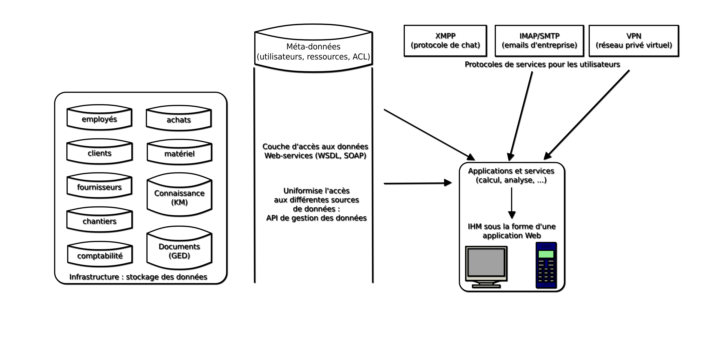

Étude préalable d'une solution développée spécifiquement
########################################################

.. contents:: Sommaire
.. sectnum::

Présentation générale
=====================

L'étude d'une solution développée spécifiquement pour GSTP permet d'axer notre
analyse sur certains besoins qui ne peuvent pas être traités par un ERP sans
certains sacrifices de la part de l'entreprise, qui pourrait devoir renoncer à
certaines méthodes de travail bien implantées dans l'entreprise.

Nous souhaitons proposer à GSTP des outils plus riches que ce qu'un ERP peut
apporter. Nous nous intéressons ainsi à des technologies et outils pour
lesquels les offres standards ne sont pas développées, nous réfléchissons à
une solution plus flexible et adaptable qui correspond mieux à l'organisation
de l'entreprise, qui serait intégralement contrôlée par GSTP.

Conception architecturale
=========================

Nous proposons un système d'information reposant sur une architecture *n-tiers*,
offrant une abstraction totale entre les sources de données, les moyens d'y
accéder ou même leurs applications pour les utilisateurs.

Le schéma suivant présente l'architecture globale du système. Il introduit
cinq couches qui seront présentées plus en détail ci-dessous :

La couche infrastructure
  C'est l'ensemble des programmes et serveurs qui gèrent les données de
  l'entreprise.

La couche d'accès aux données
  L'accès et la manipulation des données est uniformisé grâce à cette couche.

La couche protocoles d'applications
  Différents services sont intégrés au système d'application par cette couche.

La couche applicative
  Cette couche fournit des outils et des services de manipulation des données.

La couche vue :
  La vue est la manière dont les données et services sont présentés à
  l'utilisateur.

L'infrastructure
----------------

Le système d'information de GSTP sera composé des données de natures
hétérogènes. Pour nous assurer d'un stockage et d'une organisation efficiente,
les moyens mis en place pour entreposer les données de l'entreprise seront
spécifiques à leur nature et leur usage.

Par exemple, des documents manipulés sur un chantier vont être dans des
formats propriétaires que nous ne pouvons pas manipuler facilement (un document
PDF, un fichier *projet* pour un logiciel de métré, ...). Pour gérer
efficacement ces données, nous pouvons utiliser un système de fichiers
virtuels. Tandis que les données des outils comme la comptabilité ou le CRM
seront gérés par un système de gestion de bases de données relationnel.

L'accès au données
------------------

L'accès au données offrira une interface (API) constituée de services web SOAP,
référencés dans un annuaire WSDL. L'implémentation de cette API sera développée
en Java sur un serveur d'application accueillant des modules réalisés par un
ETL comme Talend.

Note : l'ETL (acronyme de *Extract, Transform, Load*) est un outil qui va
permettre d'uniformiser et d'accélérer le développement de la couche d'accès
aux données.

Protocoles d'application
------------------------

Le SI va intégrer différents serveurs offrant des services de différentes
natures qui seront fournis aux utilisateurs. Les services intégrés peuvent
être, par exemple, un VPN (Virtual Private Network), un serveur d'e-mails ou de
communication instantanée, etc.

Couche applicative
------------------

La couche applicative va manipuler les données et services proposés dans le
système d'informations. C'est à ce niveau que les données seront
calculées et recoupées. Un exemple d'application peut être l'élaboration de
statistiques d'utilisation d'un matériel, ou la génération du planning d'un
employé.

Les technologies mises en place au niveau de la couche applicative seront
hétérogènes et liées aux besoins. Cette couche est en fait le *backend* des
vues et sera généralement réalisée à partir de langages de script comme PHP,
Ruby ou Python (avec un framework comme Rails, Symfony ou Django).

Couche vue
----------

La couche vue sera réalisée avec les langages web *frontend* (HTML, CSS et
javascript). L'objectif est de réaliser des vues qui seront accessible à
travers un navigateur. On parle alors de client léger. Cette solution offre de
nombreux avantages : elle est moderne, pratique et rapide à mettre en place.

Par ailleurs, une vue exécutée à travers un navigateur est rapidement adaptable
aux nouveaux appareils nomades (smartphones, tablettes).

Analyse de l'architecture applicative cible
===========================================

Nous allons maintenant présenter les principales composants de la solutions
spécifiques et leur intégration dans les services de GSTP.

Achat
-----

TODO

Gestion du matériel
-------------------

TODO

Maintenance
-----------

TODO

Vente
-----

TODO

Définition des stratégies d'optimisation
========================================

L'optimisation se fera par rapport à 3 axes :

#. Traçabilité : l'emplacement, l'état d'un matériel pourra être connu à tout
   moment.
#. Efficacité : GSTP sera plus réactive, plus rapide.
#. Efficience : Les coûts et les procédures seront diminués.

Nous détaillerons ici les 

Processus acquisition du matériel
---------------------------------

Traçabilité
  Le matériel est enregistré dans une base de données dans le système dès la
  réception. Il est alors clairement identifié, et pourra être suivi dans le
  système.

Efficacité
  Les offres fournisseurs pourront être mises à jour par les fournisseurs eux
  mêmes, permettant d'être tenu au courant des nouveautés. 

Efficience
  Le matériel sera acheté au meilleur prix, au regard des délais d'obtentions
  voulus. L'outil informatique sera mis à profit pour effectuer cette
  comparaison de manière exhaustive (l'ensemble de l'offre fournisseur sera
  évaluée) et rapide (ce traitement pouvant être automatisé dans une certaine
  mesure, par un outil similaire à Google Squared).
  Le matériel sera acheté à la bonne quantité, pour éviter les ruptures ou les
  immobilisations trop fortes.
  
Processus approvisionnement en pièce de rechange
------------------------------------------------

Traçabilité
  L'intégralité des pièces entre en base de données dès réception, et est mis à
  jour lors de leur utilisation. Il est donc possible d'avoir un inventaire en
  temps réel du stock de pièces de rechange.

Efficacité
  De la même manière que pour le processus achat matériel, les fournisseurs
  pourront mettre à jour leur offre, qui sera récupéré par notre système, de
  manière aussi automatique et transparente que possible.
  Les magasins pourront aussi commander des pièces, livrables directement à
  l'atelier, ce qui accélère le processus, en évitant une centralisation, et
  donc des transports inutiles.
  
Efficience
  Ici, l'efficience découle du gain en traçabilité : GSTP pourra acheter le
  bon nombre de pièces. Des achats opportunistes pourront être effectués, par
  exemple en cas de baisse temporaire du prix d'une pièce, elle pourra être
  achetée en grande quantité. Le système permettra d'avoir une vue globale sur
  l'offre fournisseur, de la même manière qu'avec le processus achat matériel.

Processus de gestion des demandes chantier
------------------------------------------

Traçabilité
  Les chantiers verront leurs données centralisées, et sauvegardés selon un
  format standard.

Efficacité
  Les demandes en chantier seront anticipées, et donc les coûts de location
  pourront être diminués.
  Le processus pourra être accéléré, en faisant passer du matériel directement
  de chantier en chantier, sans passer par le siège : les demandes planifiées
  en matériel pourront chercher dans les chantiers allant se finir dans un
  futur proche, libérant ainsi du matériel.
  Le matériel pourra être rendu directement par le chantier, ce qui permettra
  encore d'économiser sur les coûts de transport.

Efficience
  Les locations pourront être globalisées, ce qui pourra permettre d'effectuer
  des économies, à la fois d'échelles (plus de matériel loué en même temps) et
  des locations pouvant s'étendre sur plus longtemps, le matériel étant utilisé
  par plusieurs chantiers, afin de profiter d'éventuels prix dégressifs.
  De part une planification plus globale, le taux d'utilisation du matériel
  pourra être maximisé.

Processus de maintenance opérationnelle
---------------------------------------

Traçabilité
  Les demandes de maintenance opérationnelles sont stockées, de manière
  uniforme.
  Les pièces de rechanges sont, comme indiqué précédemment, rentrée dans le
  système, pour arriver à une gestion de stocks en temps réel.

Efficacité
  Le gain en efficacité de cette partie découle des gains en efficacité de
  l'approvisionnement en pièce de rechange. Les pièces de rechanges peuvent
  être commandées juste avant une date de maintenance préventive, pour ne pas
  bloquer le processus de maintenance parce qu'une pièce doit être commandée.
  Les gammes opératoires seront formalisées (et entrée dans le systèmes de
  *Knowledge Management*), ce qui permettra de capitaliser, et donc d'augmenter
  l'efficacité des opérationnels sur les opérations de maintenance.

Efficience
  De la même manière, l'efficience pour la maintenance opérationnel est une
  externalité de l'efficience de l'approvisionnement en pièces de rechanges :
  le processus est mieux maitrisé, permettant d'avoir une réponse ajustée.
  Les opérations de maintenances seront évaluées, ce qui permettra d'améliorer
  les gammes de maintenance, et une meilleur estimation du besoin en pièces.

Processus de gestion des retours chantiers vers le parc de matériel
-------------------------------------------------------------------

Traçabilité
  Les différents matériels étant déjà tracé par les processus en amont, ce
  processus continue l'action.
  Les disponibilités de matériels sont alors connus dans le temps.

Efficacité
  Une maintenance préventive est effectué dès que possible, permettant de
  lisser les coups de réparation, et de diminuer les investissements. Le
  système permet d'alerter quand un matériel n'a pas eu de maintenance
  préventive depuis longtemps, puisque qu'il est tracé au sein du système.
  On pourra donc observer une réduction des coûts de maintenance.
  
Efficience
  La planification est améliorée, les opérationnels ont une meilleurs
  visibilité.

Processus de planification de maintenance
-----------------------------------------

Traçabilité
  Le opérations de maintenances sont consultables. Les opérations passées
  restent accessibles.

Efficacité
  La maintenance préventive est planifiée, et donc a plus de chance d'être
  respecté. Le taux de panne et d'indisponibilité doit diminuer, et donc les
  coûts de maintenances baissent.

Efficience
  Les opérations de planification sont automatiquement ajouté au système, en
  fonction du type de matériel et de son taux d'utilisation. Puisque tous les
  équipements sont référencés dans le système, il n'y a pas de risque d'oublis.
 

Processus de mise à disposition de matériel
-------------------------------------------

Traçabilité
  Les procédures de transfert de matériel de chantier à chantier étant
  clairement définies et intégrée dans le logiciel, les équipement ne peuvent
  pas être « perdus ».
  Les livraisons de matériel sont planifiés, permettant de mieux ordonnancer
  leur répartition.

Efficacité
  Les équipements sont mis à disposition plus vite.

Efficience
  Les coûts de transports sont réduit, puisqu'il est moins nécessaire de passer
  par le parc central (il reste nécessaire d'y passer lorsqu'un besoin de
  maintenance se fait sentir). Les transports de matériels peuvent être
  mutualisés entre chantiers.

Impact sur l'organisation
=========================

Réactivité
----------

Pour optimiser la réactivité de l'entreprise, les opérationnels concernés 
doivent anticiper sur les prestations partenaires. Le fait que le service 
soit fourni sous forme d'application web permet d'y accéder facilement depuis 
un smartphone ou un PDA quel que soit l'endroit où l'on se trouve. Ainsi, dès 
qu'une opération a lieu, que ce soit la réception d'un matériel, le constat 
d'un matériel défectueux ou encore une transaction concernant un chantier, 
la personne en charge peut immédiatement renseigner son travail auprès du 
siège central où l'information sera traitée.
Il s'ensuit une réactivité accrue car le fait que la plupart des chantiers ne 
soient pas informatisés pouvait entraîner de lourds retards dans ces démarches.
L'organisation s'en trouve donc simplifiée à la fois pour la gestion sur le 
site central des opérations diverses et pour la saisie du suivi de ces 
opérations sur les chantiers.

Gestion de nouvelles données
----------------------------

L'architecture de notre solution est telle qu'il est complètement transparent pour les utilisateurs de travailler avec des données venant de sources complètement différentes. Si GSTP envisage de diversifier ses sources de données, par exemple en créant un nouveau département spécialisé, cette opération ne nécessitera aucun temps d'adaptation contrairement à ce qui serait inévitable avec l'organisation actuelle, étant donné les lourdes démarches mises en évidence pendant l'étude de l'existant.
De même, il est parfaitement envisageable de mettre en place un service permettant de coupler les plannings prévisionnels des chantiers avec des informations concernant la météo. L'organisation s'en trouverait donc simplifée car combinée à un petit module d'aide à la décision, cette fonctionnalité fournirait des propositions sensées quant à des modifications de plannings de chantiers.

Services internes
-----------------

Pour les deux points évoqués ci-dessus, il ressort que l'organisation de GSTP doit être drastiquement modifiée sur plusieurs points. Notamment, comme il a été évoqué dans l'étude de l'existant, les accords commerciaux de GSTP avec les entreprises partenaires devront être revus afin d'établir de nouvelles relations. En particulier, les distributeurs de smartphones seront ciblés afin de pouvoir équiper à prix raisonnable l'ensemble des chantiers gérés par GSTP. De même, l'accès à des données privées peut être délicat à obtenir. Il conviendra donc d'être spécialement vigilant lors des contacts avec les détenteurs de ces données. Encore une fois, la direction commerciale de GSTP devra être grandement renforcée.

