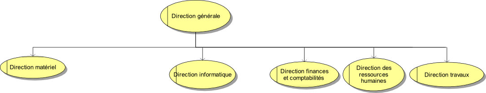
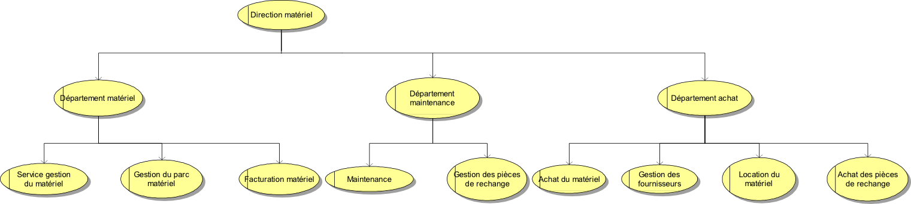

======================
Synthèse de l'existant
======================

.. contents:: Sommaire
    :depth: 2
.. sectnum::

Introduction
============

Ce projet consiste à l'étude préalable de la refonte d'une partie du système
d'information du domaine "gestion de matériel" de l'entreprise GSTP.
Les objectifs de cette refonte sont d'améliorer les délais, de diminuer les
coûts et d'améliorer la qualité à tous les niveaux.
Ce document présente l'état actuel de l'entreprise GSTP en vue de détecter les
anomalies de fonctionnement, et donc de proposer par la suite des solutions.

Domaine d'étude
===============

Seul le domaine de la gestion du matériel (DM) de GSTP sera étudié.

Activités concernées
========================

GSTP est une entreprise de travaux, spécialisée dans les activités de
terrassement et Génie Civil. Il sont soucieux de protéger l'environnement. Dans
les travaux de terrassement la qualité environnementale est de rigueur, quelque
soit l'endroit d'intervention (aggloméré ou désertique).

Services proposés par GSTP
--------------------------
- Décapage
- Déblais
- Remblai
- VRD et assainissement
- Caniveaux, Drainage
- Construction de piste et excavation
- Démolition, débroussaillage
- Aménagement et installation infrastructure de base

GSTP assure d'autres travaux spéciaux:

- Forage horizontal
- Mur de soutènement gabionnage
- Construction de jetée sur mer

Actions :
---------
- Humidification des zones d'évolution des engins.
- Balayage quotidien. 
- Captage et neutralisation de déchets. 
- Limiter la circulation et les zones de circulation pour l'évacuation et la livraison.
- Emplacement de stationnement pour les engins et véhicules sur le chantier
  pendant toute la durée des travaux. 
- Triage des déchets et réduction au maxi des salissures occasionnés. 

Directions et Services de GSTP
================================

Direction générale (DG)
-------------------------

Elle est la plus haute instance de l'entreprise. Elle définit les axes
stratégiques de fonctionnement et donne les objectifs globaux à atteindre. Elle
a aussi pour rôle d'appuyer et de coordonner l'ensemble des activités techniques
et financières de l'entreprise et d'en assurer le contrôle. 

Direction des ressources humaines (DRH)
--------------------------------------------------

Les Ressources Humaines se positionnent davantage en fonction de support qu'à la
gestion quotidienne des chantiers. Cette fonction permet de faciliter
l'anticipation dans la gestion des plannings, voire la mise en œuvre d'actions
de formation. Ainsi cela permet de traiter plus efficacement les questions
relatives à la gestion des ressources humaines.

Direction des finances et comptabilité (DFC)
--------------------------------------------------

Cette direction est chargée de la gestion financière.
Le Service de la Comptabilité est divisé sous-sections qui s'occupent
respectivement : des salaires, de la sécurité sociale et des impôts, du suivientes clients/beso
des fournisseurs et des banques, de la caisse et de l'approvisionnement.

Direction informatique (DI)
--------------------------------------------------

La DI est responsable de l'ensemble des composants matériels informatiques
(postes de travail, serveurs, équipements de réseau, systèmes de stockage, de
sauvegarde et d'impression, etc.) et des logiciels du système de gestion (paye,
comptabilité,gestion du personnel, etc.), ainsi que du choix et de l'exploitation
des services de télécommunication mis en oeuvre.

Cette direction doit gérer des applications logicielles indépendantes, développées en interne, utilisant des fichiers. Le Responsable de la DI est notamment chargé:

- D'anticiper les évolutions imposées par la stratégie de l'entreprise, les
  évolutions du contexte des Systèmes d'information, et d'appliquer les lois en
  vigueurs (ex.: CNIL)
- De commander des projets.
- D'administrer les bases de données ainsi que les serveurs d'applications.

Direction du matériel (DM)
--------------------------------------------------

La Direction du matériel joue un rôle de fournisseur (location du matériel)
vis-à-vis des chantiers. Elle est chargée de différents missions :

- La mise à la disposition du matériel aux chantier.
- L'organisation de la maintenance du matériel (entretien, rénovation et réparations).
- L'organisation du stock de pièces pour les réparations.
- Facturer l'utilisation du matériel aux chantiers.

Elle est décomposée en trois départements qui sont décomposés à leur tour en services:

- Département matériel
  - Service gestion du matériel
  - Gestion du parc matériel
  - Facturation Matériel

- Département maintenance
  - Service gestion des pièces de rechange
  - Service de maintenance

- Département Achat
  - Service gestion des fournisseurs
  - Service d'achat du matériel
  - Service d'achat des pièces de rechange
  - Service location du matériel
    
Direction travaux, études et méthodes (DTEM)
--------------------------------------------------

La DTEM est responsable de l'exécution des travaux d'un ou de plusieurs
chantiers. C'est le pivot de l'organisation et de l'exploitation des chantiers
dirigés par les chefs de chantier. Le responsable de travaux exerce son métier
directement sur les chantiers. Il dirige et organise le chantier, compose les
équipes dirigées par le chef de chantier, surveille l'avancement des travaux,
rédige les rapports, dialogue avec les ingénieurs et les riverains du chantier.
Il est responsable vis-à-vis de son client du respect des délais et de la
qualité de l'ouvrage. Il est également responsable du respect des règles
d'hygiène et de sécurité sur le chantier. Réactif et communiquant, il a une
forte charge de travail.

Zoom sur le domaine d'étude 
---------------------------

Département Matériel
~~~~~~~~~~~~~~~~~~~~

Le département matériel est composé de trois services :

Service Gestion du Matériel
    Planification/affectation du matériel aux chantiers
Gestion du Parc Matériel
    Réception/envoi du matériel
Facturation Matériel 
   Facturation du matériel 

Département Maintenance
~~~~~~~~~~~~~~~~~~~~~~~

Le département maintenance se décline en deux parties :

Préventive 
  - Restitution par un chantier (révision)
  - planning d'entretien 

Rénovation, par exemple suite à une panne

Il est composé de deux services :

Gestion des Pièces de Rechanges
  - Approvisionnement/réception/valorisation
  - Lieux : magasins
Maintenance 
  - Planification/exécution/valorisation des opérations de maintenance 
  - Lieux : ateliers
 

Département Achat
~~~~~~~~~~~~~~~~~

Le département achat est composé de quatre services

Gestion des fournisseurs
  - obtenir les meilleurs matériels aux moindre coûts
Achat du matériel
  - achat/renouvellement de nouveaux matériels
Achat des pièces de rechanges
  - Achat de pièces de rechange pour la réparation des matériels usés ou défectueux.
Location du matériel
  - location de matériels lorsque la parc matériel n'est plus suffisant pour répondre aux besoins
  - achat d'autres prestations (maintenance, etc.)

Caractéristiques des chantiers
~~~~~~~~~~~~~~~~~~~~~~~~~~~~~~

Les chantiers se déroulent en moyenne sur 1 an. Ceux sont le centre de profit de GSTP. Ils sont autonomes financièrement et fonctionnellemennt. Leurs principaux postes de coûts sont :
- Main d'oeuvre
- Matériaux
- Matériel (30% à 40% du coût global)

Les chantiers effectuent des demandes d'approvisionnement en matériel à la DM. On observe donc une relation de client-fournisseur entre les chantiers (DTEM) et la DM respectivement.

Organisation géographique
========================= 

L'entreprise GSTP a une organisation géographique assez complexe. Voici les
différents lieux où se situe l'entreprise, et une brève descriptions.

Siège
  - Regroupe les services administratifs et les structures fonctionnelles
Chantiers
  - Les chantiers sont répartis sur un rayon de 500 km autour du siège
Ateliers
  - Un atelier principal
  - Un atelier par chantier
Magasins (pièces de rechange)
  - Un au siège
  - Deux magasins délocalisés

Organisation des ressources
===========================

Ressources Humaines 
--------------------

Ressources matérielles
-----------------------

===========================   ===================
Type de matériel              Quantités
===========================   ===================
Engins de travaux             Environ 400
Matériel de génie civil       Environ 200
Camions de transports         Environ 300
Petits matériels              Plusieurs centaines
Pièces de rechange            Plusieurs centaines    
===========================   ===================

Environnement extérieur
=======================

L'environnement extérieur de l'entreprise comprend les fournisseurs, et les
clients. Les fournisseurs sont responsables de l'approvisionnement en pièces de
rechange, en matériel, tout aussi bien en ce qui concerne l'achat que la
location. L'entreprise est donc dépendant de ces fournisseurs pour son activité.

Existant informatique
=====================

Matériel
--------
Environ 30% des chantiers sont équipés en matériel informatique, ce matériel
étant composé d'un ou de plusieurs ordinateurs.  Le département matériel dispose
de 7 postes et de 6 imprimantes.  Le siège, quant à lui, dispose de 60 postes
informatiques, d'imprimantes, et d'un serveur.

L'état du matériel n'est pas défini.

Logiciel
--------
- Logiciels techniques (calculs, métriques, etc),
- Relevé et transmission de données de gestion d'un chantier vers le siège,
- Spécifiques et développés en interne :

  - Application de gestion de planning (matériels)
  - Application de facturation (matériels)
  - Application de gestion des stocks de pièces de rechange (semble spécifique)
  - Application de planification de la maintenance (différent de l'application
    de gestion de planning)
  - Application de gestion des fournisseurs (achats)
  - Application de gestion de bons de commande (achats)

Aucun outil prévu spécifiquement pour la communication entre les postes et le
serveur. Fiabilité difficile à évaluer.

Compétence
----------
- La direction du matériel ne gère pas le matériel informatique !
- La direction informatique assure l'exploitation des systèmes de gestion de l'entreprise
- Bureautique de base dans les chantiers (Excel...)

Procédures 
===========

Transversalités des procédures
--------------------------------

Différents services de GSTP travaillent et communiquent ensemble à différents niveaux en vue de gérer le matériel. Des procédures formalisées ont été mises en place pour déterminer précisemment les étapes de traitement et les flux d'information.

+--------------------------------+--------------------------------------------------------+
| Procédure                      | Services concernés                                     |                                           
+================================+========================================================+
| Facturation des chantiers      | - Service Gestion du matériel                          |                   
|                                | - DFC                                                  |                               
|                                | - Chantier                                             |                                           
+--------------------------------+--------------------------------------------------------+
| Affectation du matériel        | - Chantier                                             | 
|                                | - Gestion du parc matériel                             |
|                                | - Service Gestion du matériel                          |                  
+--------------------------------+--------------------------------------------------------+
| Maintenance                    | - Chantier                                             |         
|                                | - Parc matériel                                        |
|                                | - Département maintenance                              |
|                                | - Gestion des pièces de rechange                       |                                         
+--------------------------------+--------------------------------------------------------+
| Achat/Location de              | - Direction du Matériel                                |                      
| matériels/Pièces de rechange   | - Département achat                                    |           
|                                | - Département maintenance                              |       
+--------------------------------+--------------------------------------------------------+

Détails des procédures
-----------------------

Seront détaillées par la suite les procédures principales établies au sein de la direction du matériel.
Elles s'appuieront sur les Modèles Conceptuels de Traitements annexés.

Facturation du matériel pour un chantier
~~~~~~~~~~~~~~~~~~~~~~~~~~~~~~~~~~~~~~~~

- Une facture résulte d'un calcul de facture de matériel.

- Un calcul de facture pour un matériel donné est effectué après plusieurs rapports :
  - Le pointage du matériel : son utilisation est terminée et il faut déterminer ce qu'il à coûté.
  - Un avis de valorisation de structure
  - Un calcul de valorisation de matériel
  - Un calcul de coût de maintenance.
  
  
- Un calcul de valorisation de matériel est effectué régulièrement

- Un calcul de coût de maintenance peut être effectué pour plusieurs raisons.
  - Régulièrement, sans élément déclencheur.
  - Après un calcul de valorisation des pièces de rechange, lui-même effectué régulièrement
  - Après réception d'un avis de valorisation de personnel.
  
Il ressort de cette procédure que les facturations découlent souvent
d'opérations effectuées régulièrement, ou bien suite à la fin d'utilisation d'un
matériel.
  
Modèle conceptuel de traitement associé : ``MCT-Facturer-chantier``

Planification de l'affectation du matériel
~~~~~~~~~~~~~~~~~~~~~~~~~~~~~~~~~~~~~~~~~~

La planification du matériel concernent son affectation aux chantiers, sa location et son achat.

- La gestion du personnel de maintenance découle d'une demande de dispositions des personnes.
- La gestion des chantiers est déterminée par le planning d'affectation de matériel.
- L'achat et la location de matériel ainsi que les planifications de maintenance
  sont effectués suite à une planification d'affectation du matériel.
- La planification d'affectation du matériel suit plusieurs événements.
  - Une autorisation d'acquisition délivrée après une demande d'achat de matériel.
  - Une maintenance préventive du matériel effectuée après un certain temps d'utilisation.
  - Une planification régulièrement effectuée pour vérifier le bon fonctionnement.
  - Une programmation d'utilisation de matériel : tel ou tel chantier va avoir besoin de tel type de matériel...
- La demande d'achat de matériel est effectuée suite à la programmation d'utilisation de matériel.
- La programmation d'utilisation du matériel découle soit d'une maintenance préventive, soit d'une vérification régulière.  

Modèle conceptuel de traitement associé : ``MCT-Planification``.

Approvisionnement en pièces de rechange
~~~~~~~~~~~~~~~~~~~~~~~~~~~~~~~~~~~~~~~

Une commande de pièces de rechange s'effectue suite à une demande
d'approvisionnement urgent par exemple pour un gros chantier si le stock est
insuffisant, ou beaucoup de pannes, ou suite à une demande simple de
réapprovisionnement.

Une demande de réapprovisionnement est faite suite à un calcul des besoins.

Un calcul des besoins peut résulter de plusieurs événements.
- Prévision d'une consommation future (par exemple un chantier prévu, non urgent)
- Si aucun besoin ne se fait ressentir, on effectue néanmoins régulièrement un nouveau calcul des besoins.
- En cas de variation de stock.
  
Une variation de stock est détectée à la suite d'un calcul du stock.

On peut calculer le stock après plusieurs événements.
- Une sortie de produit (vente, utilisation, ...)
- Un inventaire, effectué à intervalles réguliers.
- L'établissement d'un avis de livraison, lui-même fait après réception du produit.

Il ressort de cette procédure que de multiples vérifications différentes peuvent
mener à la commande d'un produit. Le risque de se retrouver en rupture de stock
est donc réduit.

Modèle conceptuel de traitement associé : ``MCT-Approvisionner-pr``.

Maintenance
~~~~~~~~~~~

Une opération de maintenance est effectuée suite à :
- Une demande de révision d'un chantier 
- Une révision prévue par le planning de maintenance
- Une demande d'intervention suite à une panne détectée sur un chantier

Dans le cas d'une panne, un diagnostic est préalablement effectué pour évaluer
sa sévérité. Cette dernière peut impliquer une demande urgente de matériel de
remplacement.

L'opération est lancée une fois le type d'opération connue et en tenant compte
des disponibilités des employés.

Le lancement d'une opération induit :
- des changements dans le planning d'affectation des personnes
- Une éventuelle demande de pièces de rechange au magasin

  Ce dernier peut effectuer une demande de réapprovisionnement urgente
  (service de réapprovisionnement) dans le cas où les pièces de rechanges
  demandées ne sont pas en stock

L'opération est réellement réalisée une fois les personnes et les pièces de rechange disponibles.

Une fois terminée, un avis de maintenance est édité pour signaler au parc le
retour du matériel et le cas échéant un avis de maintenance chantier pour le
prévenir que le matériel est de nouveau disponible.

Modèle conceptuel de traitement associé : ``MCT-Maintenir-pr``.

Dysfonctionnements constatés
=============================

L'existant est source de nombreux dysfonctionnements qui impactent négativement
l'entreprise : délais dépassés, dépenses inutiles, qualité non contrôlée, etc.
Ils représentent donc des axes d'améliorations majeurs qui devront être pris en
compte prioritairement dans l'élaboration de la solution cible.
  
Département Matériel
---------------------

Le coût de la location du matériel élevé. Actuellement, on vérifie la disponibilité
du matériel lorsque le département matériel reçoit une demande d'un chantier.
Les demandes ne sont pas anticipées et donc aucun lissage n'est fait sur les
demandes des chantiers en matériel. Par conséquent, pendant certaines périodes,
beaucoup de location de matériel sont nécessaire, ce qui provoque des importants
postes de dépenses. Lors des périodes creuses, en revanche, le matériel reste
dans le parc.

L'entrée du matériel dans le parc n'est pas formalisé. Il existe plusieurs
évènements d'entrée du matériel: avis de livraison, demande suite à la
restitution du matériel, avis de maintenance. Ces entrées sont traités avec des
bons d'entrée dans le parc, qui sont rédigés par plusieurs personne. Le format
de n'est bon n'est pas standardisé. Le traitement est long et que le matériel
est bloqué pendant un certain temps avant de devenir disponible.

La planification du matériel est très lourde et le moindre retard dans l'une
ou l'autre des opérations peut énormément retarder les commandes de matériel,
elles-mêmes retardées par le dialogue avec les fournisseurs, etc.

Le matériel n'est jamais transféré de chantier à chantier. Celui-ci doit
d'abord passer par le siège.

Département Achat
-----------------

Le coût des achats est élevé. Le département achat ne possède pas de solution SRM
(Supplier Relationship Management). Les informations sur les fournisseurs sont
sauvegardées et gérées dans un fichier Excel. 

Il n'existe pas d'outil pour associer les fournisseurs avec les produits lors
des prises de décision d'achat pour que le coût revienne minimal à tous les
niveaux. 

Il est difficile d'identifier les fournisseurs potentiels et à élaborer une
cartographie en les qualifiant en fonction de leur coût, de leur capacité de
production, leurs délais de livraison, leurs garanties en terme de qualité
etc.

Les contrats avec les fournisseurs sont des fois mal formalisés en termes des
clauses spécifiques concernant la logistique, les modalités de paiement, la
qualité de service ou tout autre engagement particulier. 

Département Maintenance
-----------------------

Le taux de pannes élevé : beaucoup de retours chantiers sont constatées et
auraient pu être évitées en améliorant la maintenance préventive. Une
meilleure planification des révisions est donc nécessaire.

Les opérations de maintenance immobilisent trop longtemps le matériel à cause
d'une mauvaise planification des ressources humaines et de la mauvaise
estimation des temps standards par type d'opération

Les coûts de maintenance sont trop élevés : les temps d'intervention sont trop
longs et les gammes opératoires mal définies.

Le stock de pièces de rechange est trop important et mal géré :

- On constate trop souvent, par manque de système prévisionnel, des demandes
  d'approvisionnements urgentes ce qui retarde les opérations
- Par peur d'être en rupture de stock sur certains produits on constate que
  certaines pièces de rechanges sont sur-commandées et d'autres sous commandées.

Les pièces de rechange au niveau des 3 magasins sont réparties de manière non
équitables entre les trois magasins

